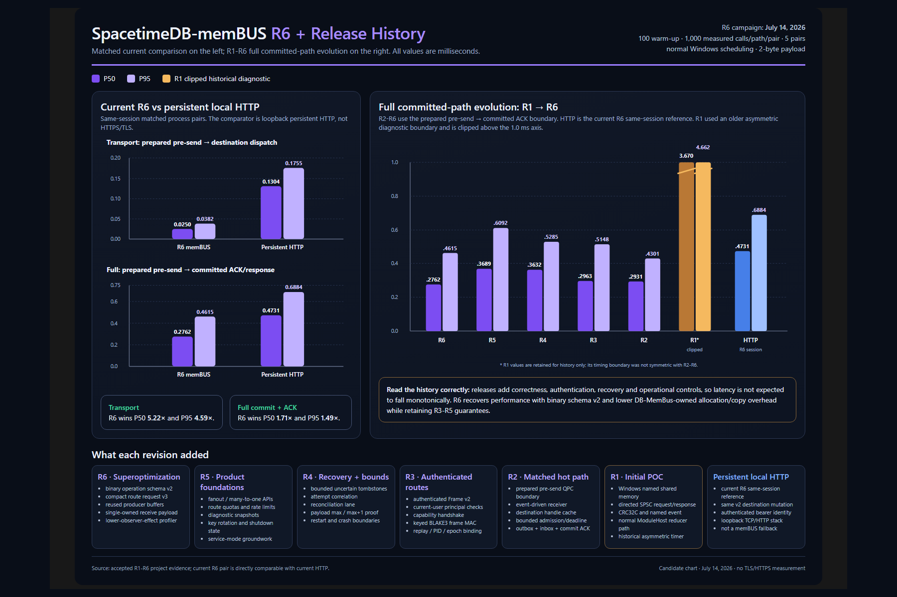
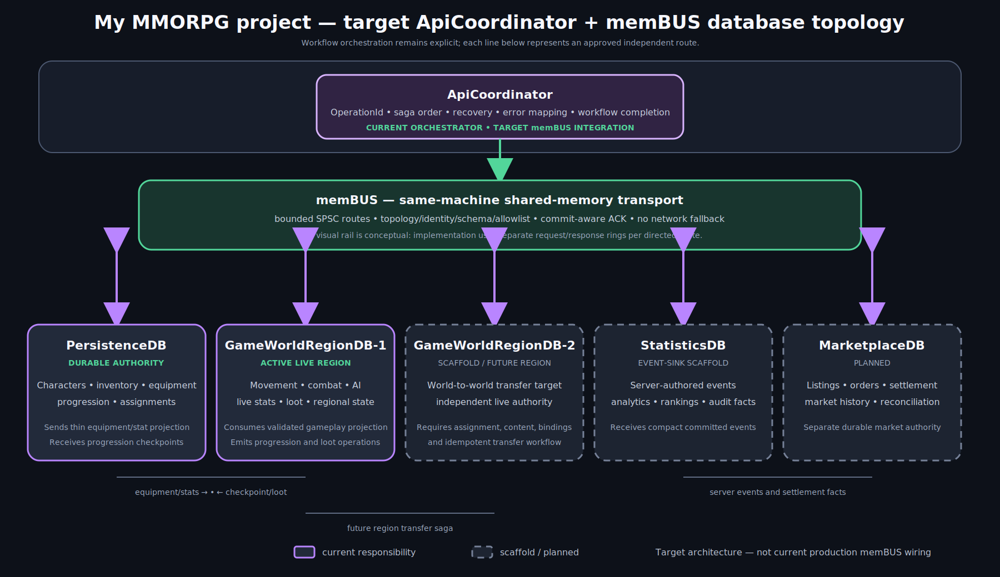

# SpacetimeDB-memBUS

SpacetimeDB-memBUS is an experimental, MOD-like extension for SpacetimeDB that lets independent database processes on the same Windows machine invoke approved destination reducers through authenticated Windows named shared memory. The short project name is **memBUS**.

It is not a second database engine. Shared memory carries framed requests, responses and bounded metadata only. Tables, transactions, pointers, WASM linear memory and `RelationalDB` objects remain process-local. Destination work enters the normal SpacetimeDB `ModuleHost`, reducer executor, transaction, durability and subscription path.

> **Current candidate:** `2.6.1-R6` — Windows x64, based on SpacetimeDB v2.6.1. The repository documentation and local package assembly are prepared. The R6 binary asset is intentionally withheld from `dist` until the project lead completes the personal extracted-package test.

> **Production licensing notice:** SpacetimeDB 2.6.1 is distributed under the Business Source License 1.1. Its Additional Use Grant permits an application or service to use no more than **one SpacetimeDB instance in production** and excludes use as a Database Service. SpacetimeDB-memBUS is designed for multiple independent instances, so a production multi-instance topology requires a commercial licence or another applicable arrangement from Clockwork Laboratories. Review [`LICENSE.txt`](LICENSE.txt), the [upstream licence](https://github.com/clockworklabs/SpacetimeDB/blob/v2.6.1/LICENSE.txt), and obtain qualified advice for your deployment.

## R6 performance preview



Five fresh matched process pairs used 100 warm-up and 1,000 measured calls per path/pair with a two-byte payload and normal Windows scheduling:

| Boundary | R6 memBUS P50/P95 | Same-session persistent local HTTP P50/P95 | Result |
|---|---:|---:|---:|
| prepared pre-send -> destination dispatch | `0.0250 / 0.0382 ms` | `0.1304 / 0.1755 ms` | memBUS `5.22x / 4.59x` faster |
| prepared pre-send -> committed ACK/response | `0.2762 / 0.4615 ms` | `0.4731 / 0.6884 ms` | memBUS `1.71x / 1.49x` faster |

All 5,000 R6 and 5,000 HTTP headline operations committed. The comparator is persistent loopback HTTP, not HTTPS/TLS, and it is not a memBUS fallback. These are candidate measurements from the documented host, not universal guarantees. Open the [R6 chart](documentation/db-membus-benchmark-chart.html), [R1-R6 history](documentation/db-membus-release-history-chart.html), or [methodology](documentation/benchmarks.md).

## Why it exists

SpacetimeDB-memBUS was created for **my MMORPG project**, which uses colocated databases with explicit ownership. `PersistenceDB` owns durable character, inventory, equipment and progression truth. Regional GameWorld databases receive only thin, validated gameplay projections and return compact progression/loot operations. An ApiCoordinator owns cross-database workflows and idempotent recovery because no transaction spans two databases.

memBUS does not replace that coordinator. **The coordinator decides the workflow; memBUS carries approved commands, projections and commit-aware acknowledgements between colocated database processes with less transport overhead.**



## One memBUS operation

```text
external trigger of a public source procedure
-> durable source outbox
-> procedure-only private async host ABI
-> topology-owned source route
-> authenticated Frame v2 / compact request v3
-> Windows named shared-memory SPSC request ring + event
-> destination validation and bounded Tokio handoff
-> normal ModuleHost::call_reducer
-> reducer AUTH + digest + inbox + mutation
-> normal destination transaction commit
-> authenticated response ring
-> correlated transaction-aware ACK
-> source outbox result
```

No arbitrary reducer gateway exists. Endpoint, publisher, subscriber, database identities, schema, channel and destination reducer must all be approved.

## Core properties

- separate standalone processes remain separate;
- one request/response SPSC pair per directed route;
- topology v4 with explicit endpoints, routes, bounds and reducer allowlists;
- current-user interactive principal checks plus route capability provisioning;
- mutual authenticated handshake and keyed BLAKE3 Frame v2 MAC;
- CRC32C, PID/process epoch, sequence, session and deadline validation;
- binary application operation schema v2 and compact route request v3;
- procedure-only C# APIs; reducers cannot call memBUS;
- `AUTH=A+`, at-least-once delivery, transaction ACK and destination inbox idempotency;
- bounded admission, uncertainty, reconciliation, rate and payload limits;
- typed failure/uncertainty; no fabricated success or silent retry;
- no HTTP, TCP, named-pipe or ApiCoordinator fallback.

## Release package quick start

The local package assembly and `dist` directory are deliberately ignored by the public repository. After the candidate passes the project-lead test and a GitHub Release asset is published, download the complete archive, extract it, then run from the extracted `2.6.1-R6` folder:

```powershell
Set-ExecutionPolicy -Scope Process Bypass
.\Test-PackageIntegrity.ps1
.\Start-Demo.ps1
```

After both black endpoint consoles show magenta `MEMBUS ... runtime ready` messages:

```powershell
.\Run-MemBus-Test.ps1
```

Expected result:

```text
"TransactionCommitted"
```

Stop and reset generated state:

```powershell
.\Stop-Demo.ps1
.\Reset-Demo.ps1
```

See [Getting started](documentation/getting-started.md).

## Commands at a glance

| Surface | Command/function | Purpose |
|---|---|---|
| Standalone | `--membus-config <file>` | Load one explicit topology |
| Standalone | `--membus-endpoint <name>` | Select the exact local endpoint |
| Security | `membus-security list-routes` | Read exact directed route IDs from topology |
| Security | `membus-security provision-route` | Create one bounded route capability file; refuses overwrite |
| C# | `ctx.MemBus.Call(...)` | Call one topology-approved reducer from a procedure |
| C# | `ctx.MemBus.Reconcile(...)` | Query one uncertain operation through the configured reconciliation contract |
| C# | `ctx.MemBus.FanOut(...)` | Call the topology-owned target set independently |
| Demo v2 | `membus_send_critical_v2` | Durable source outbox -> memBUS -> committed ACK update |
| Demo v2 | `membus_retry_pending_v2` | Retry only the same immutable operation contract |
| Demo v2 | `membus_reconcile_critical_v2` | Resolve committed/failed/conflict/not-found/unknown state |
| Demo v2 | `membus_apply_operation_v2` | Source AUTH, SHA-256, inbox idempotency and mutation |
| Package | `Start-Demo.ps1` | Verify, provision, restore and open both endpoint consoles |
| Package | `Run-MemBus-Test.ps1` | Execute one committed R6 alpha -> beta call |
| Package | `Stop-Demo.ps1` | Send Ctrl+C to exact packaged PIDs |
| Package | `Reset-Demo.ps1` | Remove generated package-local state after shutdown |

### Example call

```powershell
$alpha = 'c2000a2d3f4047d10d648d6641d04f4e8698d6a8cfad978155e5d7bdebae4b23'
$operation = [guid]::NewGuid().ToString('N')

& .\tools\spacetimedb-cli.exe call --anonymous `
    -s http://127.0.0.1:3910 --no-config $alpha `
    membus_send_critical_v2 beta alpha-beta $operation '[71,79]'
```

The normal client call above is only the trigger. The database-to-database leg after the source procedure enters `ctx.MemBus.Call` is authenticated shared memory.

## Delivery contract

Initial delivery is **at least once**, not exactly once. A stable 128-bit operation ID identifies the business operation; each transport attempt gets a different correlation ID. The destination inbox identity is `(source database identity, operation ID)`. The destination recomputes SHA-256, accepts an exact duplicate idempotently and rejects operation-ID reuse with a different digest.

`TransactionCommitted` means the normal destination reducer transaction returned committed and subscriptions were published. It does not claim fsync. `TimedOut`/`Unknown` remain uncertain and require reconciliation; they are never converted into success.

## Revision path

- **R1:** initial Windows named-shared-memory/SPSC proof of concept; historical asymmetric timer.
- **R2:** matched QPC boundaries, event-driven receiver, destination cache, bounded admission/deadline, outbox/inbox and commit ACK.
- **R3:** authenticated Frame v2, principal/capability handshake, keyed MAC and replay/PID/epoch binding.
- **R4:** bounded uncertainty, attempt correlation, reconciliation lane, crash/restart and payload boundary proof.
- **R5:** fanout/many-to-one foundations, quotas/rate limits, snapshots, rotation, shutdown and service groundwork.
- **R6:** binary schema v2, compact route request v3, reusable producer buffers, single-owned receive payload and lower-observer-effect profiling.

## Remaining acceptance work

- project-lead extracted-package test of the R6 assembly; the binary asset remains intentionally withheld until that test passes;
- fresh-module publication reproducibility for later rebuild outputs;
- four-process schema-v2 fanout/many-to-one rerun;
- elevated Windows SCM/Session 0/service ACL acceptance;
- repeated P99/P99.9, crash, soak, pressure and service-mode campaigns.

The project remains a focused same-machine transport. It will not add automatic HTTP fallback, arbitrary reducer execution, cross-process transactions, shared database objects or unbounded retries.

## Documentation

- [Documentation index](documentation/README.md)
- [Getting started](documentation/getting-started.md)
- [Architecture](documentation/architecture.md)
- [End-to-end path](documentation/end-to-end.md)
- [Configuration](documentation/configuration.md)
- [Command reference](documentation/commands.md)
- [Protocol and delivery](documentation/protocol.md)
- [Operations](documentation/operations.md)
- [Benchmarks](documentation/benchmarks.md)
- [Troubleshooting](documentation/troubleshooting.md)
- [Upgrade strategy](documentation/upgrade-guide.md)

## License and support

Read [LICENSE.txt](LICENSE.txt), [THIRD_PARTY_NOTICES.md](THIRD_PARTY_NOTICES.md), [Security](SECURITY.md) and [Support](SUPPORT.md) before use or redistribution. Source code is not included at this project stage.
