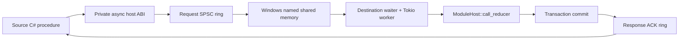

# SpacetimeDB-memBUS

SpacetimeDB-memBUS is an experimental, MOD-like extension for SpacetimeDB that lets independent database processes on the same Windows machine invoke approved destination reducers through named shared memory. The short project name used throughout the documentation is **memBUS**.

It is not a second database engine and it does not share tables, transactions, pointers, or `RelationalDB` objects between processes. Shared memory is transport only. Destination work still enters the normal SpacetimeDB `ModuleHost`, reducer executor, transaction, commit, durability, and subscription path.

> Current release: [`2.6.1-1`](2.6.1-1/) — Windows x64, based on SpacetimeDB v2.6.1.

## Why it exists

SpacetimeDB-memBUS was created for **my MMORPG project**, which is built as a set of colocated SpacetimeDB databases. `PersistenceDB` owns durable character, inventory, equipment, and progression truth. A regional GameWorld database needs only a thin, validated gameplay projection: equipped items, relevant stats, authority/revision metadata, and the live state required to simulate that region. When gameplay changes durable progression, a compact checkpoint travels back to PersistenceDB.

The current `ApiCoordinator` in my MMORPG project owns cross-database workflows such as enter-world, leave-world, loot pickup, recall, and recovery. It uses explicit `OperationId` records and idempotent source/destination steps because no transaction can span two databases. The target architecture keeps that orchestration, but connects the coordinator and colocated databases through approved memBUS routes to reduce the HTTP/SDK callback and polling overhead visible in the current setup.

memBUS does not replace ApiCoordinator. **ApiCoordinator decides the workflow; memBUS carries approved commands, projections, events, and commit-aware acknowledgements between database processes.**


```text
PersistenceDB
  durable items/equipment/stats
          ↓ thin equipment + stat projection
GameWorldRegionDB
  live movement/combat/AI/gameplay
          ↓ progression checkpoint / loot operation
PersistenceDB
  durable apply and reconciliation
```

For trusted processes on one machine, named shared memory removes the socket, HTTP routing, text framing, and network callback layers from the database-to-database hot path. The bus itself opens no public network listener. Current-user Windows ACLs, explicit topology, database identities, schemas, process epochs, reducer allowlists, sequence validation, CRC32C, destination authorization, and normal reducer transactions remain mandatory. That makes the intended path both faster and more tightly scoped than exposing another general network endpoint; it does **not** make validation or idempotency optional.

The measured transport-to-dispatch P50 is `0.040 ms` for memBUS versus `0.722 ms` for persistent local HTTP. Full transaction results have a different boundary and are documented honestly. Open the [printable latency comparison](2.6.1-1/db-membus-benchmark-chart.html) or read [Benchmarks](documentation/benchmarks.md).

Read [The MMORPG project use case](documentation/mmorpg-use-case.md) for ownership, item/equipment transfer, regional gameplay, ApiCoordinator responsibilities, and the planned rollout.

### One memBUS hop



## Core properties

- separate standalone processes remain separate;
- one SPSC ring per directed route;
- Windows named mappings and events, scoped to the current user;
- CRC32C-protected, versioned binary frames;
- process epochs, sequence numbers, route/schema/identity validation;
- procedure-only asynchronous C# API;
- explicit topology and per-destination reducer allowlists;
- `AUTH=A+`, at-least-once delivery, transaction-aware ACK, inbox idempotency;
- typed failures and uncertainty — no fabricated success;
- no HTTP, TCP, named-pipe, or ApiCoordinator fallback.

## Quick start

For the ready-to-run ZIP distribution, extract it first and follow `INSTRUCTION.md`. Run `.\Start-Demo.ps1`, wait until both consoles report `MEMBUS ... runtime ready`, and then run `.\Run-MemBus-Test.ps1` from another PowerShell window.

The sample release contains two complete endpoint packages:

```text
2.6.1-1/
├── alpha/  # source, port 3910, logical CPU 0
├── beta/   # destination, port 3920, logical CPU 1
├── seed/   # verified clean database seeds restored on first start
└── tools/  # matching bundled SpacetimeDB CLI
```

The recommended launcher opens both endpoint consoles in the required handshake window:

```powershell
Set-Location .\2.6.1-1
.\Start-Demo.ps1
```

On the first start, it verifies and expands both approximately 43.5 MiB seed archives into ignored local `data/` directories. It starts alpha, waits only for standalone to generate the release-local JWT keys, and then starts beta immediately. Do not wait for alpha's listener before starting beta: route readiness requires both endpoint processes. No system-wide CLI installation or pre-existing database snapshot is required.

Manual two-window startup remains available:

```powershell
# Window 1
Set-Location .\2.6.1-1\alpha
.\Start-Alpha.ps1
```

```powershell
# Window 2
Set-Location .\2.6.1-1\beta
.\Start-Beta.ps1
```

Then run the committed MemBus example:

```powershell
.\2.6.1-1\alpha\Send-MemBusSample.ps1
```

Expected result:

```text
"TransactionCommitted"
```

The starters, topology, clean database seeds, bundled CLI, samples, configuration template, flow SVG, and SHA-256 manifests are included. Generated data, keys, logs and PID files remain outside version control. See [Getting started](documentation/getting-started.md) for prerequisites and exact verification.

## Commands at a glance

| Surface | Command/function | Purpose |
|---|---|---|
| Standalone | `--membus-config <file>` | Load one explicit topology file |
| Standalone | `--membus-endpoint <name>` | Select the exact local endpoint |
| C# | `ctx.MemBus.Call(...)` | Call one configured reducer from a procedure |
| Demo | `membus_send_critical` | Durable source outbox, MemBus call, committed ACK update |
| Demo | `membus_retry_pending` | Replay an uncertain operation with the same OperationId |
| Demo | `membus_apply_operation` | Authorized destination inbox/effect mutation |
| Script | `Start-Alpha.ps1` / `Start-Beta.ps1` | Start and pin the packaged processes |
| Script | `Start-Demo.ps1` | Restore both seeds and open the coordinated two-process demo |
| Script | `Send-MemBusSample.ps1` | Execute the bundled shared-memory example |
| Script | `Send-LocalHttpSample.ps1` | Explicit plain-HTTP local comparison |
| Script | `Send-HttpsSample.ps1` | TLS-only comparison through an external HTTPS endpoint |

### Example call

An external client first triggers the source procedure on `alpha` through the normal SpacetimeDB API:

```powershell
$alpha = 'c200c612cf22f9e2b7881c82cf55edd0734b1c95137c1e2616863dcf3672d926'
$operationId = [guid]::NewGuid().ToString('N')

& .\2.6.1-1\tools\spacetimedb-cli.exe call --anonymous -s http://127.0.0.1:3910 --no-config `
    $alpha `
    membus_send_critical `
    beta `
    alpha-beta `
    $operationId `
    '[71,79]'
```

Inside `membus_send_critical`, after committing the source outbox transaction, the procedure switches to shared-memory transport:

```csharp
var result = ctx.MemBus.Call(
    targetEndpoint: "beta",
    channel: "alpha-beta",
    reducer: "membus_apply_operation",
    payload: encodedArgs,
    timeout: TimeSpan.FromSeconds(5),
    operationId: operationId
);
```

The host accepts this call only when `alpha` is an approved publisher, `beta` is the configured subscriber, `alpha-beta` exists, and `membus_apply_operation` appears in beta's reducer allowlist. The request frame then travels through the `alpha → beta` shared-memory ring; after the destination transaction commits, the typed ACK returns through the reverse response ring.

There is no command that enables arbitrary reducer execution. A target, channel, caller identity, schema, and reducer must all be approved by topology and destination code.

See the [complete command reference](documentation/commands.md).

## Delivery contract

Initial delivery is **at least once**, not exactly once. A stable 128-bit `OperationId` follows the request. The destination reducer owns an inbox row keyed by that ID and rejects payload-hash conflicts.

`TransactionCommitted` means the destination reducer returned a committed transaction outcome. It does not claim an fsync boundary. `TimedOut` and `Unknown` mean the result must be reconciled; they are never converted into success.

## Performance status

Matched two-byte, warm, same-host measurements on build `2.6.1 - 4`:

| Boundary | MemBus P50 | HTTP P50 | Result |
|---|---:|---:|---|
| Publication/send to destination dispatch | 0.040 ms | 0.722 ms | MemBus 18.05x faster |
| Full mutation + commit + response/ACK | 3.670 ms | 2.761 ms | HTTP 1.33x faster at P50 |

For the full path P95, MemBus measured 4.662 ms versus HTTP 6.432 ms. These boundaries must not be mixed. The shared-memory transport is already fast; the current v2.6 adapter still resolves database → leader → module on every call.

See [Benchmarks](documentation/benchmarks.md).

## Documentation

- [Documentation index](documentation/README.md)
- [Getting started](documentation/getting-started.md)
- [Architecture](documentation/architecture.md)
- [Complete end-to-end flow](documentation/end-to-end.md)
- [Configuration](documentation/configuration.md)
- [Command reference](documentation/commands.md)
- [Protocol and delivery semantics](documentation/protocol.md)
- [Operations and lifecycle](documentation/operations.md)
- [Benchmarks](documentation/benchmarks.md)
- [Troubleshooting](documentation/troubleshooting.md)
- [Development and verification](documentation/development.md)
- [Upgrade strategy](documentation/upgrade-guide.md)

## Status and limitations

Verified: frame/ring protocol, strict topology, cross-process Windows mapping/events, private ABI, C# opt-in/stock compatibility, real reducer commit, duplicate suppression, CPU-pinned packaged launch, matched dispatch benchmark, and full transaction-aware ACK timing.

Not yet accepted: exact crash/restart boundary campaign, Windows Session 0/service ACL behavior, real three-destination fanout, graceful modified-runtime Ctrl+C proof, and final ModuleHost hot-path optimization.

## License

This distribution derives from SpacetimeDB v2.6.1. Read [LICENSE.txt](LICENSE.txt) and [THIRD_PARTY_NOTICES.md](THIRD_PARTY_NOTICES.md) before use or redistribution. The upstream Business Source License is not an Open Source license before its stated change date.

## Support

- [Security](SECURITY.md)
- [Support](SUPPORT.md)
- [Release changelog](CHANGELOG.md)
