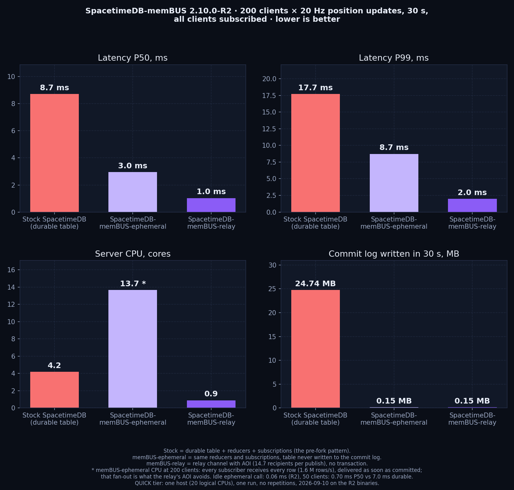
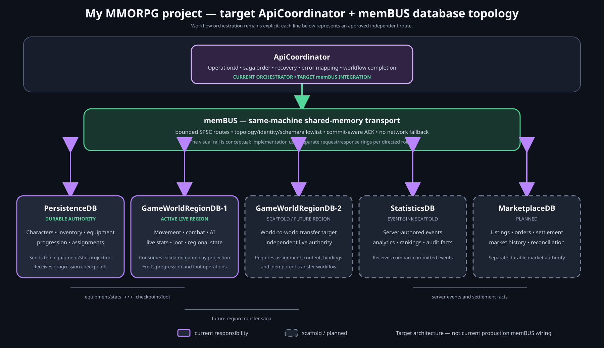

# SpacetimeDB-memBUS

**SpacetimeDB-memBUS is one fork build of SpacetimeDB that ships three capabilities:**

| Component | What it is | Short name used in this repository |
|---|---|---|
| **SpacetimeDB-memBUS** | authenticated Windows shared-memory transport for approved reducer calls between independent SpacetimeDB processes on one machine (the original product, R1–R6) | *memBUS* (transport) |
| **SpacetimeDB-memBUS-ephemeral** | *ephemeral tables*: a table attribute that keeps rows in server RAM with full transactions, indexes and subscriptions but **never writes them to the commit log**; empty after a restart by contract; durable → ephemeral migration of an existing table by a normal publish | *memBUS-ephemeral* |
| **SpacetimeDB-memBUS-relay** | *relay channel*: a non-transactional broadcast lane on the existing client WebSocket with named channels, area-of-interest (AOI) fan-out, per-connection rate limits and an optional server-side bridge reducer; **0 bytes of durability per message** | *memBUS-relay* |

memBUS-ephemeral and memBUS-relay do not need the memBUS transport. The `2.10.0-R2` package contains the full product build (all three) and a relay-only build (Ephemeral + Relay on a single database process).

**Scope of memBUS: databases on the same machine only.** memBUS connects independent SpacetimeDB processes that run on one Windows host, in the same interactive logon session, through named shared memory. It is not a network transport, has no listener, and never falls back to HTTP, TCP or named pipes. Databases on different machines are out of scope by design. memBUS-ephemeral and memBUS-relay are per-process features and have no such placement requirement.

> [!WARNING]
> **2026-09-10 — 2.10.0-R2 is a Windows x64 test candidate on SpacetimeDB v2.10.0.** It has passed automated clean-package verification (two-process committed memBUS calls, relay/ephemeral end-to-end checks, restart contract, graceful shutdown). Project-lead testing, the six-hour soak and final release acceptance remain pending. It is not production-ready.

> **Current candidate:** `2.10.0-R2` — Windows x64, SpacetimeDB v2.10.0. Previous candidate: `2.6.1-R6` (SpacetimeDB v2.6.1), kept in [CHANGELOG.md](CHANGELOG.md).

> **Production licensing notice:** SpacetimeDB 2.10.0 is distributed under the Business Source License 1.1. Its Additional Use Grant permits an application or service to use no more than **one SpacetimeDB instance in production** and excludes use as a Database Service. memBUS is designed for multiple independent instances, so a production multi-instance topology requires a commercial licence or another applicable arrangement from Clockwork Laboratories. memBUS-ephemeral and memBUS-relay on a single instance stay inside the grant only if the rest of your deployment does. Review [`LICENSE.txt`](LICENSE.txt), the [upstream licence](https://github.com/clockworklabs/SpacetimeDB/blob/v2.10.0/LICENSE.txt), and obtain qualified advice.

## What 2.10.0-R2 measured

Workload: 200 clients, each sending a position update at 20 Hz for 30 s, every client subscribed to all the others. One host, 20 logical CPUs, one run (QUICK tier: regression evidence, not a guarantee).



| | Stock SpacetimeDB<br>(durable table, reducers, subscriptions) | SpacetimeDB-memBUS-ephemeral<br>(same reducers, ephemeral table) | SpacetimeDB-memBUS-relay<br>(relay channel with AOI) |
|---|---:|---:|---:|
| Latency P50 | 8.7 ms | 3.0 ms | **1.0 ms** |
| Latency P99 | 17.7 ms | 8.7 ms | **2.0 ms** |
| Server CPU | 4 cores | 14 cores * | **1 core** |
| Commit log written in 30 s | 24.74 MB (≈ 71 GB/day) | **0 B** | **0 B** |
| What a subscriber receives | every row | every row | rows from neighbours in AOI range (14.7 per publish) |

\* Fan-out cost, not a defect: at 200 clients every subscriber receives every row (1.6 M rows/s), which is exactly what the relay's AOI avoids. The R1 send-path wake-up defect is fixed in R2: an idle single ephemeral reducer call dropped from 15.9 ms to 0.06 ms, the 200-client P99 from 101.7 ms to 8.7 ms; at 50 clients the ephemeral table is 0.70 ms P50 versus 7.0 ms durable (findings and the before/after rows in [Benchmarks](documentation/benchmarks.md)).

Cross-database calls on 2.10.0-R2, memBUS versus the stock alternative (a procedure calling the other database over HTTP on loopback). Same host, same fixture, fresh databases per repetition, median of three repetitions, two-byte payload, closed loop:

| | Stock (HTTP from procedure) | SpacetimeDB-memBUS |
|---|---:|---:|
| Full call with destination commit, 1 client, P50 / P99 | 1.30 / 2.06 ms | **0.58 / 0.81 ms** |
| Same, 8 concurrent clients, P50 / P99 | 1.56 / 2.59 ms | **0.68 / 0.93 ms** |
| Throughput, 32 operations per call × 8 concurrent | 89 k ops/s | **108 k ops/s** |
| Throughput, 32 operations per call × 32 concurrent | collapses (port exhaustion, 95 failed calls) | **110 k ops/s** |

The ingress floor (a procedure that returns immediately) is 0.43 / 0.54 ms P50 / P99 on this host, so memBUS adds about 0.15 ms to a call that commits on the other database; HTTP adds about 0.9 ms and opens a new TCP connection per call, which is what exhausts the dynamic port range at 32 × 32. The HTTP column needs a benchmark-only server build (stock SpacetimeDB refuses loopback HTTP from procedures); it is not shipped.

Interactive chart: [2.10.0-R2](documentation/db-membus-2.10.0-r2-ephemeral-relay-chart.html). Methodology, all rows and caveats: [Benchmarks](documentation/benchmarks.md).

## Why it exists

SpacetimeDB-memBUS was created for **my MMORPG project**, which uses colocated databases with explicit ownership. `PersistenceDB` owns durable character, inventory, equipment and progression truth. Regional GameWorld databases receive thin, validated gameplay projections. An ApiCoordinator owns cross-database workflows.

2.10.0 added what the game world needed next: the 20 Hz movement, rotation and cast traffic of every player used to be reducer calls into durable tables that every zone subscriber received — one long session wrote ~350 GB of commit log. With **Ephemeral** the live tables (movement segments, anim state, casts, combat events, monster motion, targets) stay in RAM; with **Relay** the presentation stream never becomes a transaction at all, and a 5-second scheduled reducer checkpoints positions durably. memBUS remains the lane for approved commands between colocated databases.



## The three components in one paragraph each

**memBUS (transport).** An approved source procedure calls a configured local route; the destination reducer runs through the normal SpacetimeDB `ModuleHost`, transaction, durability and subscription path; the source receives a correlated commit-aware acknowledgement or an explicit uncertainty. Participants, route, schema and destination operation must all be approved. No arbitrary reducer gateway, no HTTP/TCP/named-pipe fallback.

**memBUS-ephemeral.** `#[table(..., ephemeral)]` (Rust) or `[Table(..., Ephemeral = true)]` (C#). Rows are inserted, updated, deleted, indexed, queried and pushed to subscribers exactly like any table, but a transaction that touches only ephemeral tables consumes no commit-log offset and is never appended; a mixed transaction persists only its durable rows. After a restart the table exists and is empty. Event and scheduled tables cannot be ephemeral. Marking an existing durable table `ephemeral` in a later publish is accepted as an automatic migration (rows cleared, flag flipped inside the publish transaction); the reverse is rejected.

**memBUS-relay.** A client subscribes to a channel with an AOI position, publishes opaque payloads, and receives `Deliver`, `Enter`, `Leave`, `SubscribeApplied` and `Error` messages on the same socket. The server keeps membership in a grid per channel, fans out to neighbouring cells, thins crowded cells, enforces payload/rate/channel limits, and optionally calls a **bridge reducer** once per interval with the last payload per sender so the module can mirror relay state into an (ephemeral) table. Wire messages are appended after the upstream protocol variants, so stock clients keep working and a stock SDK simply never sees relay frames.

## Release package quick start

The local package assembly and `dist` directory are ignored by the public repository. Download the separately published test-candidate asset, verify its adjacent SHA-256 file, extract it, then run from the extracted `2.10.0-R2` folder:

```powershell
Set-ExecutionPolicy -Scope Process Bypass
.\Test-PackageIntegrity.ps1
.\Start-Demo.ps1
```

After both black endpoint consoles show magenta `MEMBUS` route-ready messages:

```powershell
.\Run-MemBus-Test.ps1                 # memBUS: 3 committed alpha -> beta calls over shared memory
.\Run-Relay-Test.ps1                  # Relay + Ephemeral: 17 CHECK lines PASS, 0 commit-log bytes from traffic
.\Run-Ephemeral-Restart-Test.ps1      # Ephemeral: durable row survives a restart, ephemeral table is empty
.\Stop-Demo.ps1
.\Reset-Demo.ps1
```

A single-process memBUS-ephemeral + memBUS-relay endpoint without the memBUS transport: `.\relay-only\Start-RelayOnly.ps1`, then `.\Run-Relay-Test.ps1 -Target relay-only`. See [Getting started](documentation/getting-started.md).

## Commands at a glance

| Surface | Command/function | Purpose |
|---|---|---|
| Package | `Start-Demo.ps1` | verify, provision routes, restore seeds, generate session JWT keys, open both endpoint consoles |
| Package | `Run-MemBus-Test.ps1` | committed alpha → beta calls through memBUS |
| Package | `Run-Relay-Test.ps1` | relay + ephemeral end-to-end checks against alpha or the relay-only endpoint |
| Package | `Run-Ephemeral-Restart-Test.ps1` | restart contract of ephemeral tables |
| Package | `relay-only\Start-RelayOnly.ps1` | memBUS-ephemeral + memBUS-relay on one database process, no memBUS transport |
| Package | `Stop-Demo.ps1`, `Reset-Demo.ps1` | graceful stop; remove generated state only |
| Standalone | `--membus-config <topology.toml> --membus-endpoint <name>` | enable memBUS for this process |
| Standalone | `--membus-relay-config <relay.toml>` | relay limits and channels (required in every relay-enabled build) |
| Module (Rust) | `#[table(accessor = t, public, ephemeral)]` | declare an ephemeral table |
| Module (C#) | `[Table(Name = "t", Public = true, Ephemeral = true)]` | declare an ephemeral table |
| Module (C#) | `ctx.MemBus.Call(...)` | invoke one topology-approved destination operation from a procedure |
| Client | `RelaySubscribe / RelayUnsubscribe / RelayPublish` | join, leave and publish on a relay channel (fork Rust SDK; raw WebSocket recipe in the docs) |

## Delivery contracts

- memBUS delivery is **at least once**; `TransactionCommitted` means the destination transaction committed and subscriptions were published, not fsync; timeout/unknown stay uncertain and require reconciliation.
- Ephemeral rows are **transactional and subscribable but not durable**: a crash or restart loses them by design; the module must be able to recreate every ephemeral row from an existing path.
- Relay delivery is **best effort, at most once, in order per sender**: a receiver that cannot keep up is disconnected by the existing WebSocket policy rather than buffered without bound; nothing is replayed.

## Revision path

- **R1–R6 (SpacetimeDB 2.6.1):** shared-memory proof of concept → matched measurement → authenticated routes → bounded uncertainty and recovery → multi-route operations → compact operations (see the history chart).
- **2.8.3 port:** lane diagnosis, `fast`/`full-safety` channel profiles, database-to-database comparator (private evidence).
- **2.10.0-R2:** port to SpacetimeDB v2.10.0 plus **SpacetimeDB-memBUS-ephemeral** and **SpacetimeDB-memBUS-relay**.

## Remaining acceptance work

- project-lead extracted-package test of 2.10.0-R2;
- six-hour soak, only with explicit approval;
- RELEASE-tier repetition of the ephemeral/relay campaign on a dedicated host (the 1000-client row is host-limited);
- root cause of two open anomalies (idle ephemeral reducer round trip 8–16 ms; ephemeral CPU/P99 at 200 subscribing clients);
- memBUS transport latency campaign on the 2.10.0 binaries;
- Windows service mode remains outside this interactive package.

## Documentation

- [Documentation index](documentation/README.md)
- [Getting started](documentation/getting-started.md)
- [Architecture](documentation/architecture.md)
- [Ephemeral tables](documentation/ephemeral-tables.md)
- [Relay channel](documentation/relay-channel.md)
- [End-to-end path (memBUS)](documentation/end-to-end.md)
- [Configuration](documentation/configuration.md)
- [Command reference](documentation/commands.md)
- [Protocol and delivery](documentation/protocol.md)
- [Operations](documentation/operations.md)
- [Benchmarks](documentation/benchmarks.md)
- [Troubleshooting](documentation/troubleshooting.md)
- [Upgrade strategy](documentation/upgrade-guide.md)

## License and support

Read [LICENSE.txt](LICENSE.txt), [THIRD_PARTY_NOTICES.md](THIRD_PARTY_NOTICES.md), [Security](SECURITY.md) and [Support](SUPPORT.md) before use or redistribution. Source code is not included at this project stage.
