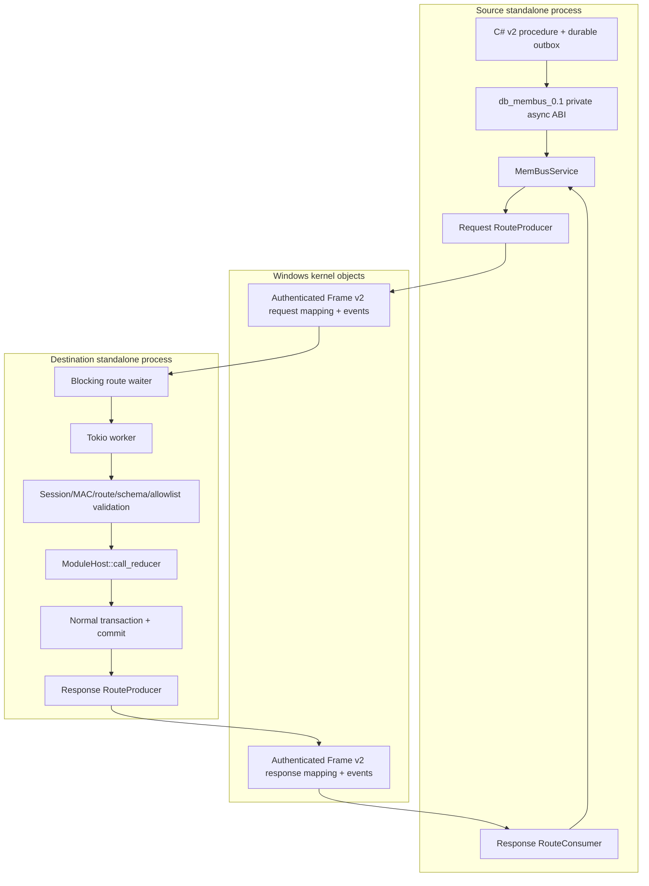

# Architecture

## Components

## Stable transport versus version adapter

The private implementation is divided into:

- `db-membus`: configuration, authenticated frames, compact route request v3, rings, mappings, events, handshakes, routes and metrics;
- `db-membus-spacetimedb`: source call service, destination invoker, inbound waiters, exact v2.6 integration;
- thin SpacetimeDB hooks: standalone bootstrap, private host import registration, C# bindings, log formatting.

This separation is the upgrade strategy: preserve the stable transport crate and rewrite only the smallest version-sensitive adapter when moving to a new SpacetimeDB release.

## Isolation rules

- one principal database remains in each standalone process;
- no transaction crosses a process boundary;
- shared memory contains immutable framed bytes and control metadata only;
- the destination reducer is the security and transaction boundary;
- source calls are asynchronous and procedure-only;
- one directed SPSC ring has exactly one producer and one consumer;
- request-response channels own independent request and response rings.

R6 keeps layered authorization: Windows principal and route capability, authenticated session/frame, topology/reducer allowlist, actual source database identity, destination `ctx.sender`, binary-v2 digest and source-scoped inbox.

## Failure domains

Frame parsing, handshake, ring publication, route lifecycle, destination invocation, and reconciliation are separate concerns. A checksum failure cannot become a reducer invocation; a reducer failure cannot be reported as a transport success; a timeout cannot be converted to a committed ACK.

## No fallback policy

If required topology, identity, schema, endpoint, Windows object, worker, or destination database is unavailable, the affected operation fails with a typed error or uncertainty. memBUS never reroutes through HTTP, ApiCoordinator, TCP, named pipes, or a direct datastore write.
