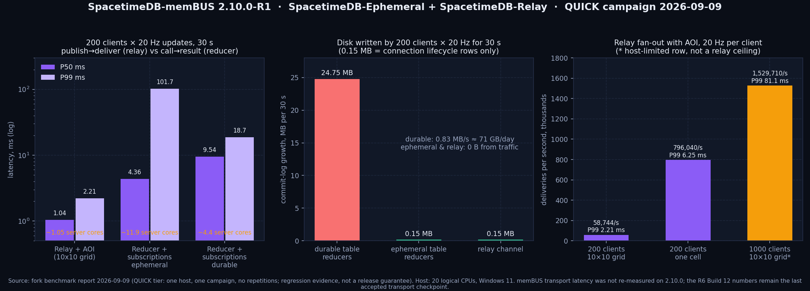

# Benchmarks

Two campaigns stand side by side and must not be mixed: the **2.10.0-R1 Ephemeral + Relay QUICK campaign** (2026-09-09) and the **R6 Build 12 memBUS transport checkpoint** (2026-07-16, SpacetimeDB 2.6.1). memBUS transport latency has **not** been re-measured on the 2.10.0 binaries.

## 2.10.0-R1 — Ephemeral + Relay (QUICK tier)

**Classification:** QUICK — one host, one campaign, no repetitions, no warm-up window; regression and development evidence, not a release result. **Host:** 20 logical CPUs, 63 GiB, Windows 11, four unrelated idle database processes in the background. **Boundary:** one benchmark process with N raw v2 WebSocket clients → relay-enabled standalone on loopback → same process; publish → deliver latency on one monotonic clock; reducer round trip = call sent → result received. **Fresh database per group** (a durable flood leaves a durability backlog that contaminates the next case — the first campaign proved it and was discarded).

 · interactive: [2.10.0-R1 chart](db-membus-2.10.0-r1-ephemeral-relay-chart.html)

### R01 — relay fan-out with AOI (20 Hz per client, 30 s, 12-byte payload)

| Case | Clients | Deliveries/s | Recipients per publish | P50 | P95 | P99 | Server CPU (of 30 s) | Commit-log delta |
|---|---:|---:|---:|---:|---:|---:|---:|---:|
| 10×10 grid, 2 per cell | 200 | 58,744 | 14.7 | 1.04 ms | 1.89 | 2.21 | 31.6 s (≈1.05 cores) | 150,945 B |
| one cell, all-to-all | 200 | 796,040 | 199 | 1.65 ms | 5.26 | 6.25 | 261.7 s (≈8.7 cores) | 150,945 B |
| 10×10 grid, 10 per cell | 1000 | 1,529,710 | 77.4 | 20.0 ms | — | 81.1 | 356.5 s (≈11.9 cores) | 755,745 B |

The commit-log delta is exactly the WebSocket connection lifecycle (~755 B per connection); relay traffic adds 0 B. The 1000-client row saturated the host (server 11.9 cores, benchmark process the rest) and is host-limited, not a relay ceiling. Zero failed clients, zero `RateLimited`, zero other errors.

### R03 — the same traffic through reducers and subscriptions (no AOI)

| Case | Clients | Committed tx/s | Fan-out rows/s | Reducer RTT P50 / P95 / P99 | Server CPU | Commit-log delta (30 s) |
|---|---:|---:|---:|---|---:|---:|
| ephemeral table | 50 | 1,000 | 99,932 | 1.30 / 16.7 / 17.9 ms | 21.2 s | 37.5 KB (lifecycle) |
| durable table | 50 | 1,000 | 99,926 | 7.57 / 11.6 / 16.2 ms | 22.1 s | 6.19 MB |
| ephemeral table | 200 | 4,000 | 1,598,722 | 4.36 / 52.3 / 101.7 ms | 357.6 s | 150.9 KB (lifecycle) |
| durable table | 200 | 4,000 | 1,598,743 | 9.54 / 15.1 / 18.7 ms | 133.3 s | 24.75 MB |

Durable: 0.83 MB/s at 4,000 tx/s ≈ 71 GB/day. Ephemeral: nothing beyond lifecycle rows.

### R02 — closed-loop write cost, no subscribers (20 s per point)

| Concurrency | Table | Committed tx/s | RTT P50 / P95 / P99 | Server CPU | Commit-log delta |
|---:|---|---:|---|---:|---:|
| 1 | ephemeral | 91.4 | 8.51 / 16.8 / 17.6 ms | 0.55 s | 501 B |
| 1 | durable | 297.3 | 3.12 / 4.22 / 6.36 ms | 2.59 s | 1.22 MB |
| 8 | ephemeral | 772.4 | 8.46 / 16.7 / 17.4 ms | 0.80 s | 5.8 KB |
| 8 | durable | 1,123.3 | 7.02 / 9.25 / 10.7 ms | 4.59 s | 4.61 MB |
| 32 | ephemeral | 3,538.8 | 8.33 / 16.7 / 17.3 ms | 4.75 s | 23.9 KB |
| 32 | durable | 4,369.6 | 7.10 / 10.0 / 12.9 ms | 9.08 s | 17.94 MB |

### Open findings (recorded, not fixed)

- **R02-C1:** an idle closed-loop client calling an ephemeral-only reducer sees 8–16 ms round trips versus 3 ms durable, in confirmed and unconfirmed read modes. Not the confirmed-reads wait, not the offset bookkeeping; the bimodal values look like a wake-up a durable commit provides and an offset-less commit does not. Under concurrent load the ephemeral path is faster. Direction for the next build: an adaptive listener (hot/warm spin, like the memBUS receiver profile) on the commit → send path.
- **R03-200:** the ephemeral variant used 357 s of server CPU versus 133 s durable at 200 subscribing clients, with P99 102 ms versus 19 ms; equal at 50 clients.

### Not done

No repetitions, no second host, no RELEASE tier. The relay with the bridge enabled under load and with crowd thinning active were not benchmarked (thinning was above every case here, so the AOI numbers are un-thinned).

## R6 Build 12 — memBUS transport checkpoint (SpacetimeDB 2.6.1)

**Classification:** accepted candidate checkpoint, interactive Windows, same machine; not SCM/Session 0 evidence and not a universal guarantee. Three fresh alpha/beta process pairs, 100 warm-up + 1,000 measured calls per path/pair, two-byte payload, normal Windows scheduling, median of run-level nearest-rank percentiles.

| Boundary | memBUS P50/P95/P99 | Persistent local HTTP P50/P95/P99 | Speedup |
|---|---:|---:|---:|
| prepared pre-send → destination dispatch | `0.0249 / 0.0355 / 0.0455 ms` | `0.1674 / 0.2446 / 0.2942 ms` | `6.72x / 6.89x / 6.47x` |
| prepared pre-send → committed ACK/response | `0.1197 / 0.1826 / 0.2245 ms` | `0.4084 / 0.6036 / 0.7779 ms` | `3.41x / 3.31x / 3.47x` |

All 3,000 operations per path committed. The explicit `<= 0.20 ms P99` target remained open at `0.2245 ms`. The comparator is persistent loopback HTTP, not HTTPS/TLS, and not a memBUS fallback. Charts: [R6 chart](db-membus-benchmark-chart.html), [R1–R6 + 2.10.0-R1 history](db-membus-release-history-chart.html). These numbers belong to the 2.6.1 Build 12 executable; the 2.10.0 binaries have only passed functional two-process verification (committed calls at 3–4 ms client-observed HTTP round trip, which includes the per-call connection lifecycle and is not a transport measurement).

## Rules for future claims

- same payload, reducer, mutation, auth and commit semantics;
- matched clocks and symmetric boundaries;
- fresh process/state/capability roots, fresh database per group;
- warm-up declared separately;
- raw count and aggregation method retained;
- P50/P95 plus repeated P99/P99.9 where claimed;
- no transport-only multiplier presented as a full-operation result;
- no host-limited row presented as a ceiling;
- no TLS/HTTPS label for the plain loopback HTTP comparator.
